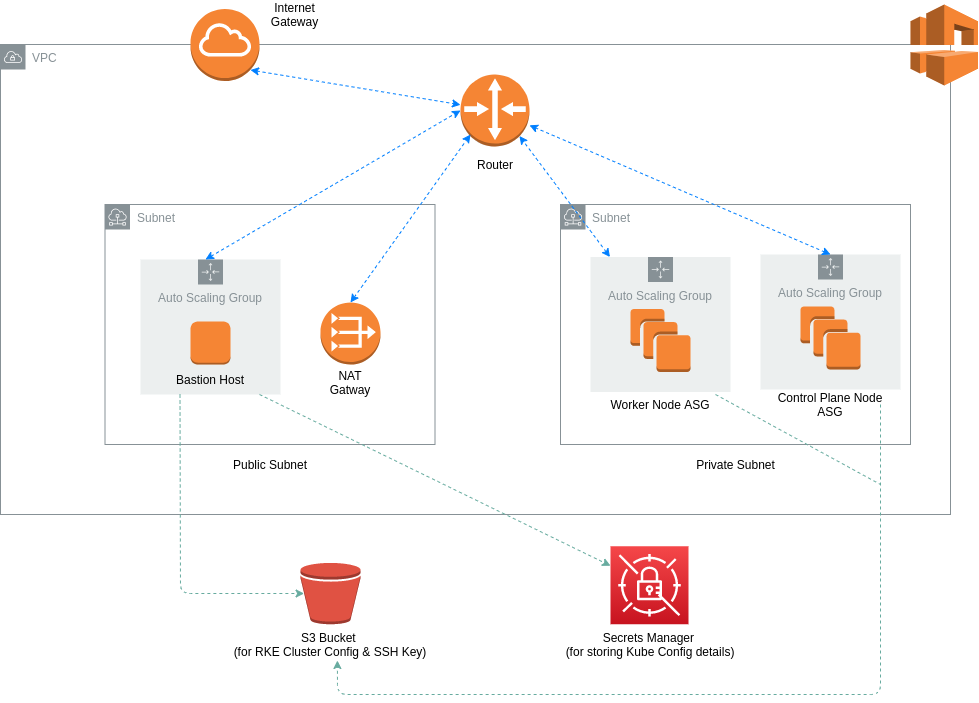
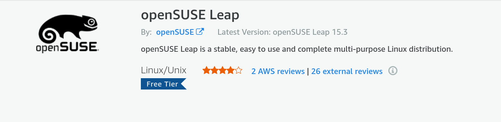

# Bootstrap RKE Kubernetes Cluster in AWS Environment
This repository contains source code to bootstrap an RKE Kubernetes cluster in AWS with a single command, provided you have met all the prerequisites and followed the initial configuration steps. 


## Architecture Overview
The diagram below depicts the overall architecture for the network VPC and the Auto Scaling Groups that are used for the RKE Kubernetes cluster.



## Prerequisites
* AWS account
* AWS profile configured with CLI on local machine
* [Terraform](https://www.terraform.io/downloads.html)
* [Terragrunt](https://terragrunt.gruntwork.io/docs/getting-started/install/)
* Understanding of how Rancher Kubernetes Engine (RKE) works.

## Project Structure
```
├── README.md
├── infra-live
|  └── dev
├── infra-modules
|  └── app-environment
├── rke-cluster-config
|  └── cluster.yml
├── sensitive.tfvars (not committed to Git repo)
└── terragrunt.hcl
```

## Initial Configuration
Before running the provisioning command, make sure to follow these initial steps.

*This project uses Terragrunt which is a wrapper for Terraform to make Terraform code more [DRY](https://terragrunt.gruntwork.io/docs/features/keep-your-terraform-code-dry/) and easy to reuse for multiple environments. Terragrunt commands are similar to Terraform commands (i.e. instead of `terraform apply` run `terragrunt apply`).*

### RKE Cluster Configuration
Create an S3 bucket that will be used to store the cluster configuration for your RKE K8s cluster. 

```aws s3api create-bucket --bucket <bucket-name> --region <region> --create-bucket-configuration LocationConstraint=<region>```

An example of the cluster config file can be found in the `rke-cluster-config` directory. Make sure you *DO NOT* populate the nodes property, this will be handled automatically by the scripts in the userdata during the infrastructure provisioning process. Once you have finalized your cluster.yml file, upload it to the S3 bucket you just created.

```
aws s3 cp ./cluster.yml s3://your-rke-cluster-config-bucket
```

### SSH Key for Cluster Nodes
Create an SSH key that will be used to establish connections with the node(s) in your cluster. You can do this from the AWS Console in the EC2 section. Upon creation, the *.pem* file will be automatically downloaded. You can upload this file to `your-rke-cluster-config-bucket`.

```
aws s3 cp ./ec2-ssh-key.pem s3://your-rke-cluster-config-bucket
```

*Take note of the name you give to this SSH Key because you will need to provide it as a variable value in the sensitive.tfvars file later.*

### Subscribe to openSUSE Leap in AWS Marketplace
The nodes in this project are provision with openSUSE Leap 15.2. In order to use this OS, you need to subscribe to it [here](https://aws.amazon.com/marketplace/pp/prodview-wn2xje27ui45o). You will need to be logged into the AWS account that you will use to provision this infrastructure. It is available for the *free tier* in AWS.



### Remote Backend State Configuration
To configure remote backend state for your infrastructure, create an S3 bucket and DynamoDB table before running *terragrunt init*. You can populate the parent terragrunt configuration file (terragrunt.hcl) in the root directory with your respective values for the bucket name (your-terraform-state-bucket) and table name (your-terraform-lock-table). In this same config file, you can update the region and aws profile name.

#### Create S3 Bucket for State Backend
```aws s3api create-bucket --bucket <bucket-name> --region <region> --create-bucket-configuration LocationConstraint=<region>```

#### Create DynamoDB table for State Locking
```aws dynamodb create-table --table-name <table-name> --attribute-definitions AttributeName=LockID,AttributeType=S --key-schema AttributeName=LockID,KeyType=HASH --provisioned-throughput ReadCapacityUnits=1,WriteCapacityUnits=1```

### Create `sensitive.tfvars` file
Your child terragrunt conig files (`infra-life/dev/app-environment/terragrunt.hcl`) is set up to read any sensitive variable values from a file called `sensitive.tfvars` at the root directory. This file is not committed to the Git repo. The contents of the file can be as follows:
```
profile="k8s-deployer"
region="eu-west-1"
cluster_name="my-rke-cluster"
key_name="my-ec2-ssh-key" 
```

## Provision Infrastructure & RKE Cluster
Once you've completed all the above steps in the initial configuration, redirect to the `infra-live/dev/app-environment` directory and run the following commands:

```
terragrunt init
terragrunt plan
terragrunt apply -auto-approve
```

To create the infrastructure for separate environments, create separate folders in `infra-live` such as `infra-live/test/app-environment` and `infra-live/prod/app-environment` with the same terragrunt.tf file located in `infra-live/dev/app-environment`.

Modify the Terragrunt config file input block for other environments to the relevant name:
### Dev
```
inputs = {
  environment    = "dev"
}
```
### Test
```
inputs = {
  environment    = "test"
}
```
### Prod
```
inputs = {
  environment    = "prod"
}
```

*Remember to update the secret name when creating the infrastructure for additional environments.*

To destroy the infrastructure run the `terrargunt destroy` command from the same location. 

## How Does It All Work?
### Automated Steps
1. VPC is provisioned by Terraform.
2. Control plane node(s) is provisioned by Terraform. The userdata script prepares the node(s) (i.e. software installation and node config steps), downloads the cluster.yml file from your bucket and updates it with the node details for each node in the control plane, and then uploads it back to the bucket.
3. Worker node(s) is provisioned by Terraform. The userdata script prepares the nodes similar to control plane nodes, downloads the cluster.yml file from your bucket and updates it with the node details for each node in the worker node group, and then uploads it back to the bucket.
4. Bastion host(s) is provisioned by Terraform. The userdata script installs the AWS CLI, RKE CLI tool and kubectl. The cluster.yml file and SSH key for the nodes are downloaded to the bastion host. The RKE provisioning command is run referencing the cluster.yml file and the SSH key locally stored on the machine. 
5. Once the RKE cluster has been provisioned, the cluster config details are saved in Secrets Manager.  
### Manual Steps
1. SSH into your bastion host using the relevant key. 
2. Copy the RKE cluster config details to the bastion hosts kube config directory from Secrets Manager
```
mkdir -p $HOME/.kube

KUBE_CONFIG=$(sudo aws secretsmanager get-secret-value --secret-id rkekubeconfig --version-stage AWSCURRENT --region eu-west-1 | jq -r .SecretString)

sudo tee $HOME/.kube/config<<EOF
$KUBE_CONFIG
EOF
```
3. Get started with deploying applications to your Kubernetes cluster!

## Known Issues
The aws provider plugin used in this project has an issue that produces an inconsistent plan that may distrupt the provisioning process after running the relevant `apply` command. In the case that you encounter this, you can simply re-run the execution command (`terragrunt apply`) and the process will continue from where it left off.

